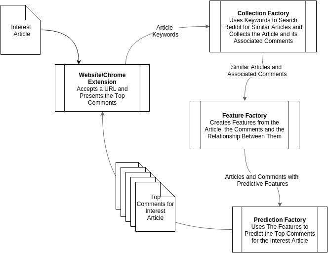

<h1>Find Your Expert</h1>

<h2>Overview</h2>

Many of us are frequent reddit users, and so it occurred to us that often times we do not necessarily know what the best comments are on certain posts. Despite having the up vote feature in reddit, our group wanted a more accurate way to determine the best comments. And so the goal of our project is to build an application that identifies the best comments for any article defined by the user. In order to provide the best and most relevant comments for articles that have somehow escaped the reddit verse, we first found similar articles that are related to the identified reddit post and from there we determined the best comments through a prediction model. Our work can be viewed through our <a href="http://ukeeem.github.io/CS109-Project-//">website</a> where final results from our prediction model is presented. In addition, our Google Chrome extension which can be found <a href="http://ukeeem.github.io/CS109-Project-//extension/">here</a> can be downloaded for easy user experience. 

<h2>Training Strategy</h2>
The overarching strategy of our application consists of two phases, a prediction phase and a training phase. The training phase results in a parametrized model to predict top comments. The prediction phase uses this model to predict the top comments for a particular article.
 
 
The following training strategy summarizes the work completed in the <a href="https://github.com/UKeeeM/CS109-Project-/blob/master/Collection%20Factory.ipynb">**Collection Factory**</a>, the <a href="https://github.com/UKeeeM/CS109-Project-/blob/master/Feature%20Factory.ipynb">**Feature Factory**</a>, the <a href="https://github.com/UKeeeM/CS109-Project-/blob/master/EDA.ipynb">**Exploratory Data Analysis** </a> and the <a href="https://github.com/UKeeeM/CS109-Project-/blob/master/model.ipynb">**Model Factory** </a>.

 
 
In order to train our model we need to collect articles tha exist in the reddit verse and the top comments related to that article. The <a href="https://github.com/UKeeeM/CS109-Project-/blob/master/Collection%20Factory.ipynb">**Collection Factory**</a> uses the Reddit API to collect a broad range of article and thier associated comments. The <a href="https://github.com/UKeeeM/CS109-Project-/blob/master/Feature%20Factory.ipynb">**Feature Factory**</a> uses this data to create features regarding the article content, the comment content and the similarity between them. The features are designed to articulate the relationship between the comments and the interest article. The final features are the result of an iterative process of extraction, exploration and modelling. The majority of the feature exploration occurs in the <a href="https://github.com/UKeeeM/CS109-Project-/blob/master/EDA.ipynb"> **EDA notebook**</a>. 

The feature extraction, EDA, modelling cycle is a continuous loop. The best model produced is effectively related to the number of times this cycle is completed.

<h3>Collection Factory</h3>
The <a href="https://github.com/UKeeeM/CS109-Project-/blob/master/Collection%20Factory.ipynb">**Collection Factory**</a> is the mechanism for collecting all of the data required for the application. The factory makes use of the reddit API to identify a broad range of articles similar to those we are expecting to use for prediction. The factory collects the comments related to each particular article and then collects the article itself. 

<h3>Feature Factory</h3>
The <a href="https://github.com/UKeeeM/CS109-Project-/blob/master/Feature%20Factory.ipynb">**Feature Factory**</a> is the mechanism for extracting useful attributes from the comments, the articles and the relationship between them. Some of the features were created at collection time to reduce the amount of data that would be stored; but we expand on those features here. The premise of our application is that the top comments, will be syntactically similar to the articles they are describing. For example, comments and users that use the same language of the article may increase the overall score of that article. The feature factory produces a large variety of these comparisons and we use EDA to determine the ones with the most predictive power.

<h3>Exploratory Data Analysis</h3>
Our exploratory data analysis shows that there is great variation between the reddit comments and the online articles. In this part of our project we looked through both the dataset of the reddit comments and the online articles. We cleaned up the dataset and added some additional columns as well as run some preliminary visualizations on them. Ultimately we selected features that we thought would be interesting to look at and applied them to the dataset using the code from the <a href="https://github.com/UKeeeM/CS109-Project-/blob/master/Feature%20Factory.ipynb">feature factory</a> and the <a href="https://github.com/UKeeeM/CS109-Project-/blob/master/Collection%20Factory.ipynb">collection factory</a>. Our analysis of the feature implemented dataset tells us that similarities between reddit comments and online articles tend to be on the lower end. A more detailed analysis of our EDA can be seen <a href="https://github.com/UKeeeM/CS109-Project-/blob/master/EDA.ipynb">here</a>.

<h3>Model Factory</h3>
**TODO**

<h2>Prediction Strategy</h2>
The following process identifies our prediction strategy. This process that occurs when we predict the top comments for an interest article. The primary difference between the prediction strategy and the training strategy is the concept of an interest article. This is the article for which we want to identify the top comments. In the training strategy we were looking at the relationship between comments and the article they were discussing. For prediction we look at the relationship between comments and the interest article. 

 
The entry to the above process is our front end website or chrome extension. This component accepts the URL of the interest article and identifies the keywords of the article. The keywords are passed to the **Collection Factory** which uses the keywords to find similar articles that exist in the reddit verse. The **Collection Factory** scrapes the similar articles and their respective comment threads. This process ensures that we comments generated from articles similar to the interest article. The articles and comments are then passed to the **Feature Factory**. The difference being we want to look at the relationships between the comments and the interest article opposed to the article they are actually discussing. 
 
 
The collection and feature extraction steps of the Prediction startegy can be summarized in the <a href="https://github.com/UKeeeM/CS109-Project-/blob/master/Prediction%20Data%20Factory.ipynb">**Prediction Data Factory**</a>
 
 
The last step is to pass the completed features to the **Model**. The **Model**  uses the features in a to identify the top comments and return them to the user.
 
 

<h2>Website</h2>

Our website displays our final results as well as initial motivation and question. It also includes a walkthrough of our project in video and contains many visualizations displaying our results. Go <a href="http://ukeeem.github.io/CS109-Project-//">here</a> to visit our website.
* Extension
